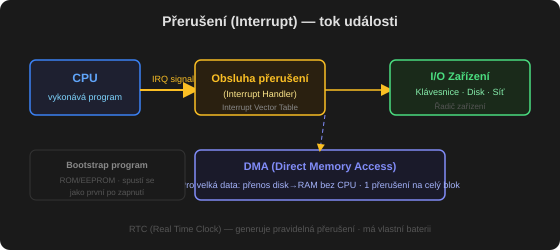

# Správa periferií a přerušení

Dvě hlavní úlohy počítače: **V/V (I/O)** a **výpočet**. Často je hlavní zájem uživatele právě V/V (čtení webu, editace souboru) – výpočet je jen "vedlejší". Kvůli obrovské rozmanitosti periferií (myš, disk, páskový robot) potřebuje OS **I/O subsystém** v jádru, který odděluje zbytek jádra od složitosti řízení konkrétních zařízení.

## Hardware V/V

### Port, sběrnice, daisy chain

- **Port** – konkrétní připojovací bod (např. sériový port)
- **Sběrnice (bus)** – sdílená sada vodičů + pevně daný protokol zpráv, které po nich mohou jít
- **Daisy chain** – zařízení A → B → C → port počítače, funguje typicky jako sběrnice

### Registry portu

| Registr | Funkce |
| :-- | :-- |
| **Data-in** | čte hostitel, aby získal vstup |
| **Data-out** | zapisuje hostitel, aby poslal výstup |
| **Status** | indikuje stav – dokončení příkazu, dostupnost dat, chybu zařízení |
| **Control** | zapisuje hostitel, aby spustil příkaz nebo změnil mód zařízení (např. duplex, parita, délka slova, rychlost u sériového portu) |

### Sběrnice (Bus)

Typický PC má **PCI sběrnici** (rychlá zařízení), **expanzní sběrnici** (pomalejší – klávesnice, USB, sériové porty) a **SCSI sběrnici** (disky). Novější rychlé sběrnice: **PCIe** (až 16 GB/s), **HyperTransport** (až 25 GB/s).

### Řadič (Controller)

Elektronika ovládající port/sběrnici/zařízení. Jednoduchý řadič (sériový port) je jeden čip; složitý (SCSI) může být samostatná deska s vlastním procesorem, mikrokódem a pamětí. CPU s řadičem komunikuje přes jeho **registry** dvěma způsoby:

- **Speciální I/O instrukce** – přenos bajtu/slova na I/O adresu portu
- **Memory-mapped I/O** – řídicí registry zařízení jsou namapované přímo do adresního prostoru procesoru, čte/zapisuje se standardními instrukcemi pro paměť

**Výhoda memory-mapped I/O:** rychlejší (např. zápis milionů bajtů do grafické paměti je rychlejší než miliony I/O instrukcí). **Nevýhoda:** náchylnější k náhodnému přepsání chybným ukazatelem (řeší ochrana paměti).

Mnoho systémů (včetně PC) používá **oba přístupy zároveň** – I/O instrukce pro některá zařízení, memory-mapped pro jiná (typicky grafiku).

### PIO vs. DMA

- **Programmed I/O (PIO)** – CPU samo sleduje stavové bity a "krmí" řadič po jednotlivých bajtech – plýtvá drahým výkonem CPU u velkých přenosů
- **[[DMA]]** – hostitel zapíše do paměti DMA příkazový blok (zdroj, cíl, počet bajtů) a předá jeho adresu DMA řadiči; ten pak sám ovládá paměťovou sběrnici bez zásahu CPU

## Správa přerušení

### Základní mechanismus

CPU má **interrupt-request line**, kterou kontroluje po každé instrukci. Když řadič zařízení na ní vyšle signál:

1. Řadič **vyvolá (raise)** přerušení signálem na lince
2. CPU přerušení **zachytí (catch)** – uloží stav a skočí na **obslužnou rutinu (interrupt handler)** na pevné adrese
3. Rutina zjistí příčinu, provede potřebné zpracování ("**vyčistí**" přerušení obsluhou zařízení), obnoví stav a vrátí CPU zpátky do stavu před přerušením

### Maskovatelné a nemaskovatelné přerušení

- **Nemaskovatelné (NMI)** – vyhrazené pro kritické události (neopravitelné chyby paměti), nejde vypnout
- **Maskovatelné** – dá se dočasně vypnout před vykonáním kritické sekvence instrukcí, kterou nesmí nic přerušit; používají ho běžné řadiče zařízení pro žádost o obsluhu

### Priorita přerušení

Umožňuje CPU **odložit** obsluhu méně důležitého přerušení bez maskování úplně všech přerušení a nechat **důležitější přerušení předběhnout** obsluhu méně důležitého.

### Vektor přerušení

Adresa obslužné rutiny se obvykle nehledá ručně, ale bere se jako offset do tabulky **vektoru přerušení** – ten obsahuje adresy specializovaných obslužných rutin pro jednotlivá zařízení. Díky tomu nemusí jedna univerzální rutina prohledávat všechny možné zdroje přerušení – najde tu správnou rovnou.

**Souvisí:** [[přerušení]], [[DMA]], [[řadič]], [[registr]], [[CPU]], [[kernel]]
