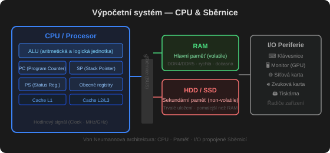

# Výpočetní systém

Výpočetní systém se skládá ze čtyř částí:

- **Hardware** – poskytuje základní výpočetní zdroje ([[CPU]], paměť, V/V zařízení)
- **[[operační systém]]** – řídí a koordinuje využívání hardwaru mezi aplikacemi a uživateli
- **Aplikační programy** – definují, jak se zdroje systému použijí k řešení úloh uživatele (textové editory, kompilátory, prohlížeče, hry…)
- **Uživatelé** – lidé, stroje, jiné počítače

## CPU (procesor)

**Procesor / CPU / mikroprocesor** je srdcem každého výpočetního systému. Načítá a vykonává instrukce uložené v paměti, provádí matematické a logické operace a řídí toky dat.

Moderní mikroprocesor kombinuje všechny své části do jednoho integrovaného obvodu. Pracuje s binárními daty (nuly a jedničky), v praxi se ale čísla obvykle zapisují šestnáctkově (viz [[Ciselne_soustavy]]).

Činnost procesoru řídí **systémové hodiny** – s každým hodinovým impulsem provede procesor operaci. Rychlost hodin (např. 100 MHz = 100 milionů impulsů/s) ale sama o sobě neurčuje výkon – různé procesory stihnou za jeden impuls různé množství práce.

### CPU registry

**[[registr|Registry]]** jsou interní paměť mikroprocesoru, slouží k ukládání dat a manipulaci s nimi. Velikost, počet a typ registrů závisí na typu procesoru (např. Intel má 32bitové, Alpha 64bitové registry).

Speciální (vyhrazené) registry:

- **Ukazatel instrukcí (Program Counter, PC)** – adresa instrukce, která se provede v dalším kroku. Po každém načtení instrukce se automaticky zvýší.
- **Ukazatel zásobníku (Stack Pointer, SP)** – ukazuje na vrchol zásobníku (paměti pracující na principu LIFO – poslední dovnitř, první ven).
- **Stavový registr (Processor Status, PS)** – uchovává informace o momentálním stavu procesoru, včetně režimu činnosti (režim jádra / uživatelský režim).

## Sběrnice (BUS)

Obvody na základní desce propojuje **sběrnice**, dělí se na tři logické celky:

- **Adresová** – udává místo v paměti (adresu) pro datový přenos
- **Datová** – obousměrná, slouží k přenosu dat mezi procesorem a pamětí
- **Řídící** – přenáší časovací a řídicí signály pro celý systém

Oblíbené sběrnice pro připojení periferií: ISA, PCI.

## Paměť

Systém má hierarchii pamětí s různou rychlostí a velikostí:

- **[[cache]]** – nejrychlejší, ale drahá paměť; dočasně ukládá obsah hlavní paměti. Procesory mívají malou interní cache a větší externí cache na desce.
- **[[RAM]] / vnitřní paměť** – rychlá, používá se během výpočtu, po dokončení se uvolní
- **[[ROM]]** – jen pro čtení, obsahuje neměnné programy (např. bootstrap)
- **[[EEPROM]]** – jde přepsat, ale ne často (např. tovární firmware smartphonů)
- **Vnější paměť** – disky, flash, cloud – stálé uložení dat a programů, které se zrovna nezpracovávají

### Volatilní vs. nevolatilní paměť

- **Volatilní** – ztrácí obsah při odpojení napájení (RAM)
- **Nevolatilní** – obsah zachová i bez napájení ([[ROM]], [[HDD]], [[SSD]], NVRAM)

### Sekundární úložiště

Hlavní paměť je malá a volatilní, proto systémy potřebují **sekundární úložiště**:

- **[[HDD]]** (Hard Disk Drive) – nejběžnější, pro programy i data
- **[[SSD]]** (Solid State Disk) – rychlejší než HDD, nevolatilní

## Řadiče (Controller)

**[[řadič|Řadiče]]** ovládají periferie (grafické karty, disky…) pomocí čipu. Jsou to v podstatě také procesory – "inteligentní pomocníci" hlavního CPU. Mají vlastní registry, přes které je ovládá CPU.

CPU musí mít pro každý řadič **softwarový ovladač zařízení**, který manipuluje s jeho registry.

### DMA (Direct Memory Access)

Při potřebě přenést větší objem dat přímo z/do systémové paměti (např. zápis na disk) se používá **[[DMA]]** – umožňuje hardwaru přímý přístup k systémové paměti pod dohledem CPU, bez zatěžování procesoru po celou dobu přenosu.

## Start systému

Aby počítač mohl začít fungovat (po zapnutí nebo restartu), potřebuje **[[bootstrap]] program** – jednoduchý program uložený ve [[firmware|firmwaru]] (ROM/EEPROM), který:

1. Inicializuje celý systém (registry CPU, řadiče, paměť)
2. Najde jádro operačního systému a nahraje ho do paměti
3. Předá mu řízení

Po nahrání **[[kernel|jádra]]** začnou běžet i **systémové procesy / démoni** (na UNIXu první je proces `init`), a systém čeká na první událost.

## Přerušení (Interrupt)

Výskyt události signalizuje **[[přerušení]]** – od hardwaru (signál po sběrnici) nebo softwaru (systémové volání).

Když je CPU přerušeno, zastaví svou činnost a skočí na pevně danou adresu, kde je obslužná rutina přerušení. Rychlé vyřízení zajišťuje **tabulka ukazatelů (vektor přerušení)** na obslužné rutiny, indexovaná číslem zařízení.

## RTC (Real Time Clock)

**RTC** je periferie, která poskytuje přesný čas a generuje pravidelné časové intervaly. Má vlastní baterii, takže funguje i po vypnutí počítače – proto PC "zná" správné datum a čas i po startu.

## Von Neumannova architektura

Většina systémů používá jeden univerzální procesor, některé i speciální procesory navíc. **Multiprocesorové systémy** (paralelní, těsně vázané systémy) mají výhody:

- vyšší propustnost
- úspora z rozsahu
- vyšší spolehlivost (odolnost vůči chybám)

Dva typy:

- **Asymetrický multiprocessing (ASMP)** – každý procesor má vyhrazený vlastní úkol
- **Symetrický multiprocessing (SMP)** – kterýkoli proces může běžet na kterémkoli procesoru

## Vstup/výstup (I/O)

Velká část kódu operačního systému se věnuje právě správě V/V. Ke sběrnici je připojeno víc řadičů, každý ovládá jeden typ zařízení. Systém typicky má **ovladač zařízení** pro každý řadič, který poskytuje jednotné rozhraní.

**Interrupt-driven I/O** – řadič po dokončení přenosu informuje ovladač přerušením. Pro velké objemy dat (disky) se používá **[[DMA]]**, aby se generoval jen jeden přerušení na celý blok dat místo jednoho na bajt.
