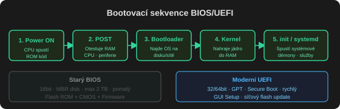

# BIOS / UEFI

Základní deska spojuje všechny díly počítače (procesor, disky, sběrnice, periferie…), ale jednotlivé prvky se mezi sebou musí "domluvit". To zajišťuje **[[BIOS]]** (Basic Input/Output System) – oživí desku a sladí parametry jejích komponent, takže deska funguje s hardwarem různých výrobců.

BIOS je v podstatě sada ovladačů základních komponent systému a funguje jako **"překladač"** mezi hardwarem a operačním systémem – vůči OS se tváří "stále stejně" bez ohledu na připojený hardware. Např. OS vidí disk jako úložiště dat, ale nemusí znát jeho konkrétní parametry (počet hlav, sektorů…).

## Tři vrstvy BIOSu

1. **Flash ROM** – vlastní program BIOS a jeho data (info o možných komponentách desky), lze přepsat programem flash
2. **CMOS** – nastavení provedená v Setupu, trvale zálohovaná knoflíkovou lithiovou baterií
3. **Firmware** – informace uložené v ROM pamětech chipsetu, procesoru a rozšiřujících karet; jejich ovladače se načtou při startu (jsou součástí Windows)

Tyto tři vrstvy zaručují komunikaci mezi aplikací a OS napříč různým hardwarem – BIOS si vytváří **[[API]]** (sadu příkazů a funkcí), takže software komunikuje jen s operačním systémem, nikdy přímo s hardwarem.

## Výrobci BIOSu

AMI BIOS, AWARD BIOS (fúzoval s Phoenixem), Phoenix BIOS.

## Start počítače a POST

1. **Inicializace** – BIOS projde sloty (PCI, PCIe, patice procesorů/pamětí), přečte z jejich ROM informace a vytvoří API. Data si uloží do CMOS (tzv. ESCD), aby to nemusel dělat při každém startu.
2. **[[POST]] (Power On Self Test)** – BIOS otestuje hardware. Při poruše se testy nedokončí a BIOS o tom informuje (hláška na obrazovce nebo beep kód).
3. **Předání řízení zavaděči** – po úspěšném POSTu BIOS najde zavaděč OS (na disku, disketě, CD/DVD, LAN, flash disku), ten načte operační systém a jeho ovladače pro komunikaci s API.

### Identifikační údaje na obrazovce

- Výrobce BIOSu (první řádek)
- **BIOS Release Number** – verze BIOSu
- **BIOS Reference Number** – kód pro výrobce desky a čipset (odlišný formát pro každého výrobce)

## Setup

Program pro definování hodnot BIOSu – volba hardwaru, nastavení parametrů, ladění spolupráce komponent. Nespouští se z OS, ale během startu (stiskem určité klávesy, viz obrazovka při startu nebo manuál desky).

## Flash (upgrade) BIOSu

**Důvody:** lepší podpora ACPI, větší podporovaná kapacita disku, rychlejší I/O porty, výměna procesoru, podpora AGP…

**Postup:** potřeba program pro přepis + datový soubor s novým BIOSem.

### Rizika

1. **Přerušení zápisu** – nesmí se stát (výpadek napájení zničí BIOS) → dělat na PC se zálohovacím zdrojem (UPS)
2. **Špatný datový soubor** – přepsání nesprávným souborem BIOS zničí; nutná přesná identifikace desky a verze

### Způsoby flashování

| Metoda | Popis |
| :-- | :-- |
| **FLASH** (např. AWDFLASH.EXE) | spustí se ze startovací diskety |
| **EZ Flash** | vestavěná utilita, spouští se během POST (např. Alt+F) |
| **UEFI Flash** | přímo v UEFI rozhraní |
| **Windows Flash Live Update** | přímo z Windows, jen u velkých výrobců PC |

### Když se upgrade nepovede

Počítač nenastartuje (černá obrazovka). Řešení:

- **Požádat dodavatele** o přepálení BIOSu (nejjistější, ale déle trvá)
- **Vlastní oprava** – vyjmout funkční čip BIOSu z identické základní desky z jiného PC, vložit do vadného, nastartovat, za běhu (BIOS je už v cache L2) vyměnit zpátky za vadný čip a přeflashovat ho ze zálohy

## Zjištění verze BIOSu

Ve Windows: `systeminfo`, Systémové informace, `regedit`, nebo přímo v UEFI BIOSu.

**Souvisí:** [[BIOS]], [[firmware]], [[API]], [[bootstrap]], [[POST]]
