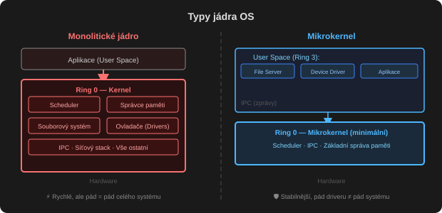

# Rozdělení OS

## Podle počtu ovládaných procesorů

### Jednoprocesorové

MS DOS, MS WINDOWS s DOS jádrem (verze 9x, ME).

### Víceprocesorové

UNIX, LINUX, WINDOWS s NT jádrem (NT, 2000, XP, Vista, 7, 8, 10).

- **[[SMP]] (Symetrický MultiProcesing)** – kterýkoli proces může běžet na kterémkoli procesoru. Prakticky všechny moderní systémy používají SMP.
- **ASMP (Asymetrický MultiProcesing)** – jeden procesor je vyhrazen pro procesy systému, uživatelské procesy běží na ostatních.

V běžných desktopech (které neoznačujeme jako víceprocesorové) najdeme víc procesorů – jeden hlavní (CPU) a ostatní pro konkrétní činnosti (např. grafický procesor na grafické kartě). Nejde o víceprocesorový systém, protože pomocné procesory nezpracovávají běžnou sadu instrukcí, jen svou specifickou.

Vícejádrový počítač lze za víceprocesorový považovat jen do určité míry – jádra v rámci jednoho procesoru mohou sdílet některé prostředky.

### NUMA (Non Uniform Memory Access)

Paměť je rozdělena na samostatné části (uzly), ke každému uzlu je samostatnou paměťovou sběrnicí připojen jeden nebo víc procesorů. Procesor přistupuje ke svému uzlu velmi rychle, k ostatním uzlům pomaleji. Smyslem je co nejvíc škálovat a zefektivnit komunikaci procesoru s pamětí – paměťová sběrnice je v multiprocesorových systémech úzké místo, a každý uzel navíc má samostatnou adresaci paměti (obchází se omezení rozsahu adresace dané počtem bitů pro adresu).

## Podle správy uživatelů

- **Jednouživatelské** – DOS, Windows s DOS jádrem
- **Víceuživatelské** – UNIX, LINUX, Windows s NT jádrem. Víc uživatelů může pracovat současně bez vzájemného ovlivňování, přihlašují se přímo na zařízení nebo vzdáleně (terminál, vzdálená plocha). Systém musí zajistit přísné oddělení prostředků různých uživatelů.

## Podle správy úloh

- **Jednoúlohové** – v jednom okamžiku je spuštěn jen jeden program (DOS, Windows s DOS jádrem)
- **Víceúlohové** – v jednom okamžiku běží víc programů, sdílejí prostředky (paměť, procesor, I/O) – UNIX, LINUX, Windows s NT jádrem

## Podle role v síti

- **Desktopové OS** – slouží uživatelům jako klientům sítě, mohou obsahovat uživatelský software a prostředky pro připojení do sítě, využívají služeb serverů. Windows s NT jádrem, MacOS, Google Chrome, Linux.
- **Serverové OS** – nainstalovány na řídicích počítačích sítě, obsahují síťové služby ([[DNS]], [[DHCP]], DBMS, WEB, APP…), prostředky pro správu databáze uživatelů a klientů. Neslouží pro práci běžných uživatelů. Linux Server, Windows Server.

## Realtime OS

Operační systémy pracující téměř v reálném čase, se zaručenou maximální dobou reakce (v nejhorším případě) na zpracování požadavku. Používají se, kde jsou vysoké požadavky na interaktivitu – řízení letadel, laboratoří, elektráren, automobilový průmysl.

Běžné OS s multitaskingem toto zaručit nemohou. Většina realtimových OS má malé jádro – **mikrojádro** – které plní jen nejzákladnější funkce (správa procesů, procesoru, I/O), ostatní funkce běží jako běžné "uživatelské" procesy.

| Systém | Popis |
| :-- | :-- |
| **QNX** | Komerční, postavený na UNIXU, kompatibilní s POSIX. Automobily, embedded zařízení. Mimořádně stabilní a rychlý. |
| **RT LINUX** | Upravený Linux pro automobilový průmysl. Realtimové mikrojádro "odstaví" standardní Linuxové jádro, které běží jako samostatný proces s nižší prioritou. |
| **Real Time Preemption Patch** | Aktualizace linuxového jádra upravující synchronizační mechanismy, časovače a obsluhu přerušení pro realtimový chod. |
| **RTX** | Nadstavba Real Time Extension pro Windows s NT jádrem. Přidává vrstvu RTX Real Time HAL Extender, nad kterou běží subsystém RTX RTSS. |

## Cloudové OS

Kód jádra a všeho, co cloudový OS nabízí, běží na procesoru a v paměti v cloudu a komunikuje s lokálním počítačem přes síťové protokoly. Lokální počítač není zatěžován, chová se jako terminál. Lze provozovat ve webovém prohlížeči, nad EFI, nebo na tenkých klientech (terminálová služba, virtualizované PC).

Příklady: Glide OS, Silve OS, Chromium OS, virtuální PC (Azure Virtual Machines).
